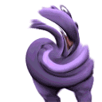
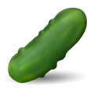
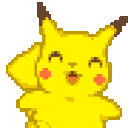
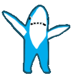

# Slack Emojis

### Upload Script
<b>Coming Soon</b>

### Manually Mass Upload
Sadly, Slack doesn't offer an endpoint for users to mass upload emojis. Lucky for us though, there is a work-around.

1. Download this repo: `git clone https://github.com/11/slack-emojis.git`
2. Install this Chrome extension: http://bit.ly/2fPY8el
3. Go to `<your_team>`.slack.com/customize/emoji
4. Drag’n’drop all emojis on the Bulk Emoji Uploader drop area.

### Why?
To save you the hours it takes to indivdually upload all of your favorite emojis.

---

### Check Out The Full Set of Emojis

| Img | Name |
| --- | --- |
| </img> | `:+111111111111:` |
| </img> | `:1up:` |
| </img> | `:2day:` |
| </img> | `:40:` |
| </img> | `:420alert:` |
| </img> | `:666:` |
| </img> | `:99:` |
| </img> | `:aawyeah:` |
| </img> | `:america_parrot:` |
| </img> | `:angrycactusboi:` |
| </img> | `:angry_taco:` |
| </img> | `:anti_parrot:` |
| </img> | `:aol:` |
| </img> | `:approved:` |
| </img> | `:aussie_parrot:` |
| </img> | `:avodude:` |
| </img> | `:awesomeface:` |
| </img> | `:bacon_dance:` |
| </img> | `:bacon-thicc:` |
| </img> | `:banana_parrot:` |
| </img> | `:baoquan:` |
| </img> | `:barney_bad_reception:` |
| </img> | `:barney_banksy:` |
| </img> | `:barney_black_and_white:` |
| </img> | `:barney_blackhole:` |
| </img> | `:barney_bounce:` |
| </img> | `:barney_boxes:` |
| </img> | `:barney_flip:` |
| </img> | `:barney:` |
| </img> | `:barney_insanely_slow:` |
| </img> | `:barney_inverted:` |
| </img> | `:barney_nsfw:` |
| </img> | `:barney_one_big_spank:` |
| </img> | `:barney_proud:` |
| </img> | `:barney_red:` |
| </img> | `:barney_slow:` |
| </img> | `:barney_smalder:` |
| </img> | `:barney_smalldest:` |
| </img> | `:barney_spin:` |
| </img> | `:barney_sunny:` |
| </img> | `:barney_superspeed:` |
| </img> | `:barney_time_traveler:` |
| </img> | `:barney_vhs:` |
| </img> | `:barney_warp_speed:` |
| </img> | `:big_ass_fan:` |
| </img> | `:black_russian:` |
| </img> | `:blargh:` |
| </img> | `:blooper:` |
| </img> | `:bmo:` |
| </img> | `:bob_omb:` |
| </img> | `:bokbok:` |
| </img> | `:booty:` |
| </img> | `:bored_parrot:` |
| </img> | `:bouncy:` |
| </img> | `:bubble_bass:` |
| </img> | `:bulby:` |
| </img> | `:burger_bounce:` |
| </img> | `:burrrrito:` |
| </img> | `:california:` |
| </img> | `:captain_planet:` |
| </img> | `:capybara:` |
| </img> | `:charizard:` |
| </img> | `:charmander:` |
| </img> | `:cheeky:` |
| </img> | `:cheese_dance:` |
| </img> | `:cheese:` |
| </img> | `:chef:` |
| </img> | `:chicken_dance:` |
| </img> | `:chill:` |
| </img> | `:chill_parrot:` |
| </img> | `:chwey:` |
| </img> | `:coconut:` |
| </img> | `:coffee_parrot:` |
| </img> | `:comehither:` |
| </img> | `:computer_rage:` |
| </img> | `:confused_parrot:` |
| </img> | `:conga_party_parrot:` |
| </img> | `:conge_parrot:` |
| </img> | `:cookie_monster:` |
| </img> | `:crabby:` |
| </img> | `:crying:` |
| </img> | `:cuc:` |
| </img> | `:dad:` |
| </img> | `:dance_corgi:` |
| </img> | `:dancing_baby:` |
| </img> | `:dancing_banana_unamused:` |
| </img> | `:dancing_charmander:` |
| </img> | `:dancing_pikachu:` |
| </img> | `:datboi:` |
| </img> | `:derp_alpaca:` |
| </img> | `:deuces:` |
| </img> | `:diddy:` |
| </img> | `:ditto:` |
| </img> | `:doc:` |
| </img> | `:doge:` |
| </img> | `:donkey_kong:` |
| </img> | `:dope:` |
| </img> | `:dotdot:` |
| </img> | `:double_dragon:` |
| </img> | `:double_thumbsup:` |
| </img> | `:dovebye:` |
| </img> | `:dove:` |
| </img> | `:doya:` |
| </img> | `:drone:` |
| </img> | `:drugs:` |
| </img> | `:drybones:` |
| </img> | `:dump:` |
| </img> | `:dumpsterfire:` |
| </img> | `:eating:` |
| </img> | `:ehonda:` |
| </img> | `:explody_parrot:` |
| </img> | `:faded:` |
| </img> | `:fall:` |
| </img> | `:fast_parrot:` |
| </img> | `:fidget:` |
| </img> | `:fieri:` |
| </img> | `:fight_koala:` |
| </img> | `:finger_guns:` |
| </img> | `:fingers_crossed:` |
| </img> | `:finn_the_human:` |
| </img> | `:fist_bump:` |
| </img> | `:flamingo:` |
| </img> | `:foldarms:` |
| </img> | `:fox:` |
| </img> | `:fox_run:` |
| </img> | `:fox_tail:` |
| </img> | `:fox_trot:` |
| </img> | `:fry:` |
| </img> | `:furby:` |
| </img> | `:gentleman_parrot:` |
| </img> | `:growing_cactus:` |
| </img> | `:hamburger_parrot:` |
| </img> | `:happyburrito:` |
| </img> | `:hypnotoad:` |
| </img> | `:ice_cream_parrot:` |
| </img> | `:indeed:` |
| </img> | `:infinite:` |
| </img> | `:lol:` |
| </img> | `:love_parrot:` |
| </img> | `:meeseeks:` |
| </img> | `:merged:` |
| </img> | `:mew:` |
| </img> | `:middle_parrot:` |
| </img> | `:mmm:` |
| </img> | `:moonwalk_parrot:` |
| </img> | `:nsfw_eggplant:` |
| </img> | `:nsfw_parrot:` |
| </img> | `:party_parrot:` |
| </img> | `:party_wizard:` |
| </img> | `:pizza_parrot:` |
| </img> | `:rainbow_frog:` |
| </img> | `:right_parrot:` |
| </img> | `:rocker:` |
| </img> | `:rose:` |
| </img> | `:sad_cowboy:` |
| </img> | `:sad_parrot:` |
| </img> | `:shark_dance:` |
| </img> | `:slow_parrot:` |
| </img> | `:spicy:` |
| </img> | `:spotify:` |
| </img> | `:teef2:` |
| </img> | `:teef:` |
| </img> | `:thegame:` |
| </img> | `:thegreatwaveoffkanagawa:` |
| </img> | `:thicc:` |
| </img> | `:thinking_face_3d:` |
| </img> | `:thinkinghand:` |
| </img> | `:triforce:` |
| </img> | `:triplets_parrot:` |
| </img> | `:true:` |
| </img> | `:ufo:` |
| </img> | `:uncomfortablericky:` |
| </img> | `:uncomfortable-smiley-2:` |
| </img> | `:uncomfortable-smiley-3:` |
| </img> | `:uncomfortable-smiley:` |
| </img> | `:waffle:` |
| </img> | `:wellplayed:` |
| </img> | `:wtf_jerry:` |
