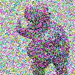

# Slack Emojis

### How to Mass Upload
Sadly, Slack doesn't offer an endpoint for users to mass upload emojis. Lucky for us though, there is a work-around.

1. Download this repo: `git clone https://github.com/11/slack-emojis.git`
2. Install this Chrome extension: http://bit.ly/2fPY8el
3. Go to `<your_team>`.slack.com/customize/emoji
4. Drag’n’drop all emojis on the Bulk Emoji Uploader drop area.

---

### Check Out The Full Set of Emojis

| Img | Name |
|--- | --- |

| </img> | `:+111111111111:` |
| </img> | `:1000000:` |
| </img> | `:1up:` |
| </img> | `:2day:` |
| </img> | `:40:` |
| </img> | `:420alert:` |
| </img> | `:666:` |
| </img> | `:99:` |
| </img> | `:angry_taco:` |
| </img> | `:angrycactusboi:` |
| </img> | `:aol:` |
| </img> | `:approved:` |
| </img> | `:avodude:` |
| </img> | `:awesomeface:` |
| </img> | `:bacon_dance:` |
| </img> | `:barney:` |
| </img> | `:barney_bad_reception:` |
| </img> | `:barney_banksy:` |
| </img> | `:barney_black_and_white:` |
| </img> | `:barney_blackhole:` |
| </img> | `:barney_bounce:` |
| </img> | `:barney_boxes:` |
| </img> | `:barney_flip:` |
| </img> | `:barney_insanely_slow:` |
| </img> | `:barney_inverted:` |
| </img> | `:barney_nsfw:` |
| </img> | `:barney_one_big_spank:` |
| </img> | `:barney_proud:` |
| </img> | `:barney_red:` |
| </img> | `:barney_slow:` |
| </img> | `:barney_smalder:` |
| </img> | `:barney_smalldest:` |
| </img> | `:barney_spin:` |
| </img> | `:barney_sunny:` |
| </img> | `:barney_superspeed:` |
| </img> | `:barney_time_traveler:` |
| </img> | `:barney_vhs:` |
| </img> | `:barney_warp_speed:` |
| </img> | `:big_ass_fan:` |
| </img> | `:black_russian:` |
| </img> | `:blargh:` |
| </img> | `:bmo:` |
| </img> | `:bob_omb:` |
| </img> | `:bokbok:` |
| </img> | `:burrrrito:` |
| </img> | `:happyburrito:` |
| </img> | `:meeseeks:` |
| </img> | `:rocker:` |
| </img> | `:sad_cowboy:` |
| </img> | `:thegame:` |
| </img> | `:thinkinghand:` |
| </img> | `:true:` |
